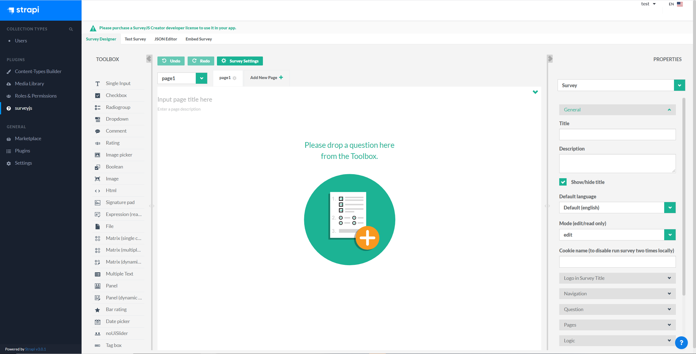

# Strapi plugin SurveyJS

Integrate [Strapi](https://strapi.io/) with [surveyJs](https://surveyjs.io/)





How to install:
--------
1. In a root folder of your strapi project run 
   ```
   #upgrade package file-loader
   npm install file-loader --save
   npm install strapi-plugin-surveyjs --save
   ```
2. Rebuild admin UI `strapi build`
3. Run strapi `strapi develop`

Use in your `model.settings.json`:
--------

```
...
  "attributes": {
    "data": {
      "type": "survey",
      "columnType": "longtext"
    }
  }
...
```

